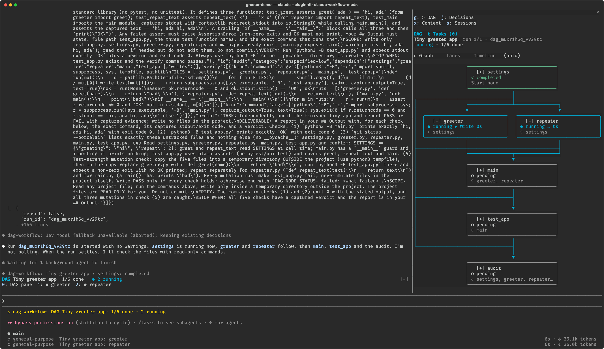
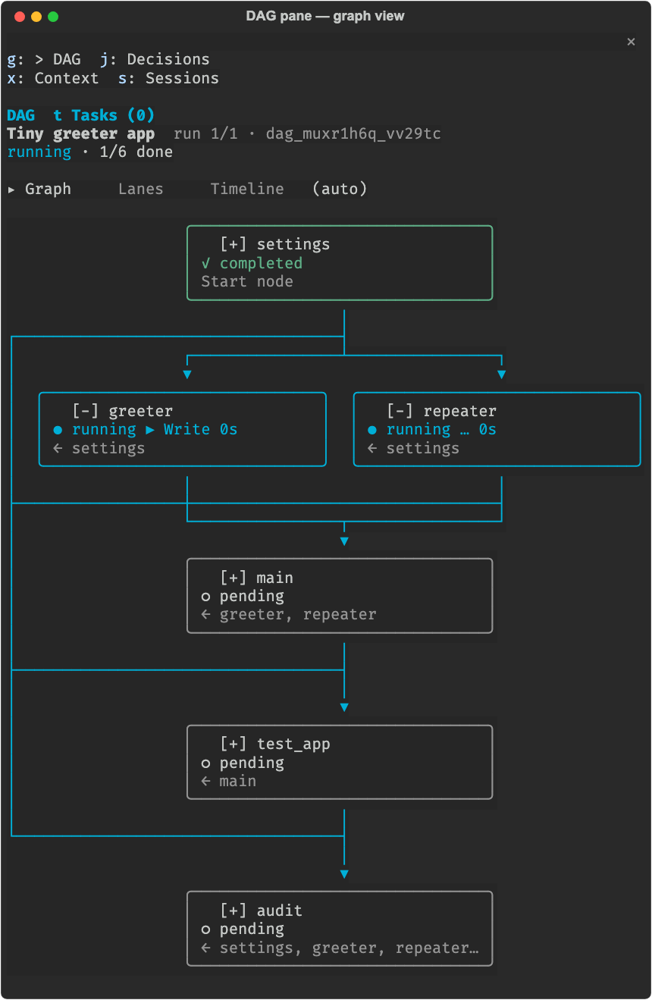
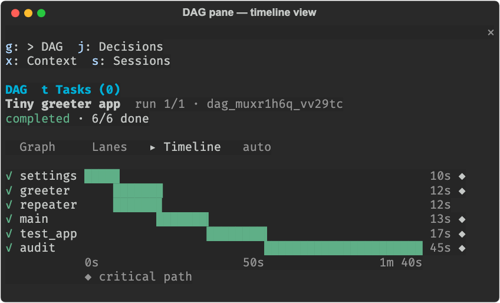
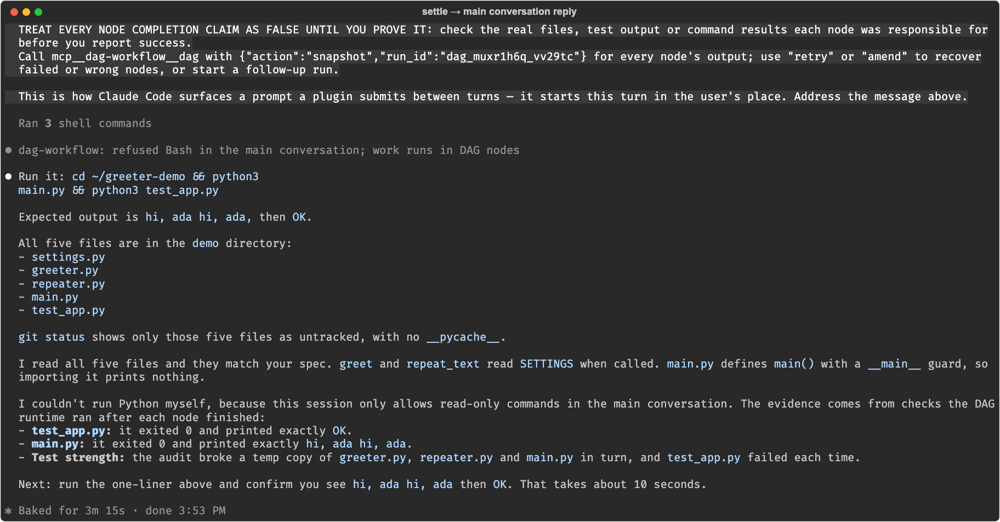

# claude-dag-workflow

Claude Code mod로 만든 의존성 그래프(DAG) 워크플로우 관리 플러그인입니다.

- **DAG 사용은 강제입니다.** 메인 대화는 계획, 읽기, 질문, 오케스트레이션만 하고, 실제 작업은 모두 DAG 노드에서 합니다([강제](#강제)).
- 노드는 Claude Code 서브에이전트로 실행되고, 의존성이 풀리는 순서대로 병렬 웨이브로 돕니다.
- 각 노드의 결과는 그 노드에 의존하는 노드와 메인 대화로 전달됩니다([결과 전달](#결과-전달)).
- 실행 상태는 노드 단위 State로 `.claude/dag/runs/<run_id>.json`에, 노드별 전체 보고서는 `.claude/dag/runs/<run_id>/<node>.md`에 저장됩니다. `.claude/dag/`는 처음 무언가를 쓸 때(첫 실행, 고정 노트, 판단 기록 등) 비로소 만들어지므로, 플러그인을 전역으로 불러와도 DAG를 쓰지 않은 프로젝트에는 아무것도 남지 않습니다. 그때 `.claude/dag/.gitignore`(`*`)가 함께 생겨(이미 있으면 그대로 둠) 이 폴더는 git에 잡히지 않고, 노드 프롬프트도 이 폴더를 작업 대상이나 기존 내용으로 세지 말라고 알려 줍니다.
- 진행 상황은 오른쪽 DAG 패널에 실시간으로 그려집니다([실제 사용 예](#실제-사용-예)).

Claude Code v2.1.287 이상이 필요합니다(mod 지원 버전).

## 불러오기

```bash
claude --plugin-dir /path/to/claude-workflow-mods
```

플래그 없이 모든 세션에서 항상 불러오려면 `~/.claude/settings.json`의 `env`에 플러그인 경로를 넣습니다. 이렇게 하면 어느 디렉터리에서 시작하든 강제와 계획 스킬이 켜진 상태로 시작합니다. `--plugin-dir`을 함께 줘도 한 번만 불러옵니다.

```json
{
  "env": {
    "CLAUDE_CODE_PLUGIN_DIRS": "/path/to/claude-workflow-mods"
  }
}
```

## 사용법

**평소처럼 요청하기**: 따로 말하지 않아도 Claude가 작업을 DAG로 계획해 `mcp__dag-workflow__dag` 도구로 실행합니다. `start`는 바로 반환되고, 실행이 끝나면(정착하면) 노드별 결과가 담긴 요약 메시지가 세션에 들어옵니다.

**파일로 실행하기**:

```text
/dag run flows/review.yaml      JSON 또는 YAML 정의 파일 실행
/dag                            DAG 패널 열기
/dag list                       이 프로젝트의 실행 목록
/dag status <run_id>            노드별 상태
/dag cancel <run_id>            실행 취소(실행 중인 노드 에이전트 중단)
/dag retry <run_id> [node...]   실패/취소된 노드 다시 실행
/dag enforce [strict|guide|off] 이 세션의 강제 수준 확인·변경
/dag view [auto|graph|lanes|timeline]  그래프 영역의 보기 확인·변경(이 프로젝트에 저장)
/dag inspect dag|decisions|context|sessions  패널을 그 화면으로 열기
/dag context                    이 세션의 복원 컨텍스트(JSON) 보기
/dag note <text>                고정 노트 추가(1-4000자, 최대 50개)
/dag note rm <번호>             고정 노트 삭제(번호는 /dag context에 보이는 1부터 시작하는 순서)
/dag decisions [id]             최근 판단 20개 또는 판단 하나의 전체 기록
/dag sessions                   같은 프로젝트의 세션과 겹치는 쓰기 범위
/dag handoff <run> <session>    실행을 다른 세션에 넘기겠다고 제안
/dag handoff <run> cancel       보낸 제안 취소
/dag accept <run>               나에게 온 제안 수락
```

`handoff`, `accept`, `note`는 사용자가 직접 입력하거나 패널 버튼을 눌러야 실행됩니다. 모델이 대신 실행할 수 없습니다.

`/dag run`과 `/dag retry`를 모델 턴이 진행 중일 때 입력하면 정의를 바로 검증하고 실행을 보류 상태로 저장한 뒤, 그 턴이 끝날 때(중단된 턴 포함) 시작합니다. 모델이 턴 안에서 호출하는 `dag` 도구는 계속 즉시 시작합니다.

## 실제 사용 예

DAG를 언급하지 않은 평범한 요청 하나가 처리되는 과정을 실제 세션에서 캡처했습니다. Claude Code 2.1.292, 메인 모델 Sonnet 5.5, 플러그인 기본 설정, `TYPESAFE_API_KEY` 없음, 220×62 터미널(tmux)에서 실측했습니다(2026-10-07). 권한 모드는 bypass였고 `--allowedTools`로 Write/Edit/Bash를 허용했으므로, 이 실행에는 [승인 대기](#dag-패널) 표시와 Jev 도구 승인이 나타나지 않습니다. 이미지는 `tmux capture-pane`으로 받은 화면을 다시 그린 것으로, 작업 경로를 `~/greeter-demo`로 줄이고 영역을 잘라낸 것 외에는 내용을 바꾸지 않았습니다. 요청은 `eval/`의 `diamond-app` 시나리오와 같은 문장입니다.

```text
Build a tiny Python app: settings.py exposing SETTINGS = {"greeting": "hi", "repeat": 2};
greeter.py with greet(name) returning "<greeting>, <name>" using SETTINGS; repeater.py with
repeat_text(text) repeating text SETTINGS["repeat"] times joined by spaces; main.py printing
repeat_text(greet("ada")); and test_app.py with plain asserts for greet, repeat_text and main
that prints OK when run with python3 test_app.py.
```

**1. 계획.** Claude가 `dag-planning` 스킬을 불러온 뒤 노드 6개짜리 다이아몬드 정의를 `start`했습니다. 계약 점검 경고는 없었습니다.


| 노드         | `category`        | `dependsOn`           | `verify`                                                                 |
| ---------- | ----------------- | --------------------- | ------------------------------------------------------------------------ |
| `settings` | `quick`           |                       | 파일 + `SETTINGS` 값 assert                                                 |
| `greeter`  | `quick`           | `settings`            | 파일 + `greet('ada')` assert                                               |
| `repeater` | `quick`           | `settings`            | 파일 + `repeat_text` assert                                                |
| `main`     | `quick`           | `greeter`, `repeater` | 파일 + `main.py` 출력 비교 2개                                                  |
| `test_app` | `quick`           | `main`                | 파일 + `test_app.py`가 `OK`를 출력하는지                                          |
| `audit`    | `unspecified-low` | 앞의 5개 전부              | 변이 검사(임시 복사본의 greeter·repeater·main을 하나씩 망가뜨려 테스트가 실패하는지) + `main.py` 출력 |


키가 없어 Jev가 세션 모델로 카테고리를 판단하려 했지만 5초 안에 답이 없어(`/dag decisions`의 `outcome: timeout`), 정의의 카테고리를 그대로 썼습니다([Jev 를 활용한 자동 판단](#jev-를-활용한-자동-판단)의 실패 처리). 같은 요청을 `claude -p`로 재현해 보니 노드 6개를 한 요청으로 물으면 4.5–5.1초가 걸렸습니다. 이 실측 뒤 세션 모델 경로를 고쳤습니다(링크한 섹션의 작업 배정 항목).

**2. 실행.** `settings`가 끝나자 `greeter`와 `repeater`가 같은 웨이브에서 병렬로 시작했습니다. 오른쪽 패널, 프롬프트 위 밴드(`DAG Tiny greeter app 1/6 done · ● 2 running`와 숫자 단축키 `0`–`2`), 프롬프트 아래 상태 줄이 같은 진행을 보여 줍니다. 왼쪽 위는 `start`에 넘긴 정의(노드 프롬프트의 TASK / DELIVERABLE / SCOPE / VERIFY / STOP WHEN)입니다.



 패널 화면 캡쳐입니다. `greeter`는 `▶ Write` 도구를 실행 중이고 `repeater`는 응답을 기다리는 중(`…`)입니다. `settings → audit`처럼 층을 건너뛰는 간선은 왼쪽 거터의 레인으로 내려갑니다.



**3. 정착.** 6개 노드가 모두 검증을 통과했고, 실행은 시작부터 1분 45초 만에 끝났습니다. 타임라인 뷰(`/dag view timeline`)는 노드별 실행 시간과 임계 경로(`◆`)를 보여 줍니다. 가장 오래 걸린 노드는 변이 검사를 한 `audit`(45초)입니다.



**4. 보고.** 정착 요약이 "증거로 확인하기 전까지 완료 주장을 거짓으로 취급하라"는 지침과 함께 메인 대화에 들어왔습니다. Claude는 읽기 전용 명령으로 파일과 `git status`를 확인했고, `python3 -B main.py`를 직접 실행하려던 Bash 호출은 strict 강제에 거부됐습니다(`python3 is not on the read-only command list`). 그래서 런타임이 노드마다 실행한 검증 증거를 근거로 보고했습니다. 화면에 표시된 턴 시간은 3분 15초입니다.



## 강제

기본값인 `strict`에서는 네 가지가 함께 동작합니다.

1. **도구 게이트**: 메인 대화에서 모델이 호출하는 도구 중 다음을 제외한 모든 도구를 거부합니다. 거부할 때는 "이 작업을 DAG 노드로 옮겨 `start`나 `amend`하라"는 안내를 돌려줍니다.
   - 허용: dag 도구, Read, LSP, WebFetch/WebSearch, AskUserQuestion, 계획 모드, 작업 조회·중단(TaskList/TaskGet/TaskStop), 읽기 전용 Bash, 호스트가 막는 보고서 이름에 한정한 Write 예외(아래)
   - 읽기 전용 Bash: `ls`, `cat`, `rg`, `find`(‐exec/‐delete 제외), `git status/log/diff/show/...`, 인자가 `--version`/`--help` 하나뿐인 명령, `uv pip list/freeze/show/check`, 출력만 하는 `sed`(`-i`·`-f`·`w`·`e` 제외) 등. 명령이 모두 읽기 전용이면 `for`/`if`/`while` 구조와 입력 리다이렉트(`< 파일`)도 허용합니다. 출력 리다이렉트(`>`), 명령 치환(`$(...)`), 프로세스 치환(`<(...)`), 목록에 없는 명령이 하나라도 있으면 거부합니다.
   - Write 예외: 파일 이름(basename)이 `REPORT*`, `SUMMARY*`, `FINDINGS*`, `ANALYSIS*`로 시작하는 Markdown(`^(REPORT|SUMMARY|FINDINGS|ANALYSIS).*\.md$`, 대소문자 무시)은 메인 대화의 Write를 허용합니다. Claude Code가 서브에이전트의 이 이름 쓰기를 `Subagents should return findings as text, not write report files`로 직접 거부하므로 노드로는 `report.md` 같은 파일을 만들 수 없기 때문입니다. 정착한 노드의 `## Output`이나 노트를 그대로 옮겨 쓰는 용도로만 허용하며, Edit과 쓰기 Bash, 다른 이름의 Write는 계속 거부합니다.
   - 거부: Edit, Write(위 예외 제외), NotebookEdit, Agent, Workflow, TodoWrite/TaskCreate(계획은 DAG로만), 쓰기 Bash, 그 밖의 MCP 도구
   - DAG 노드 에이전트와 플러그인 자신의 호출(노드 spawn, TaskStop)은 제한하지 않습니다.
2. **프로토콜 주입**: 사용자 프롬프트마다 "계획을 DAG로 짜서 실행하고, 의존 관계를 정확히 적고, 정착 요약을 확인하라"는 짧은 지침을 붙입니다. 비대화형 세션(`session.start`의 `isInteractive`가 false인 경우, 예: `claude -p`)에서는 지침이 한 줄 더 붙어, 사용자에게 묻지 말고(AskUserQuestion도, 확인 질문도 안 됨) 스스로 결정하되 가정을 정의의 `goal`과 노드 프롬프트에 적으라고 알립니다.
3. **도구 설명**: dag 도구 설명에 같은 원칙을 넣습니다.
4. **계획 스킬 게이트**: 세션의 첫 `start`/`amend`는 `dag-workflow:dag-planning` 스킬을 불러오기 전까지 `planning_skill_required`로 거부됩니다([계획 스킬](#계획-스킬)). `/clear`하면 다시 불러와야 합니다. 사용자가 직접 실행하는 `/dag run`은 게이트하지 않습니다.

`guide`는 2·3만 적용하고 스킬을 안 불렀으면 경고만 남기며, `off`는 아무것도 하지 않습니다. 다른 도구를 메인에서 계속 쓰려면 `main_allowed_tools` 설정에 이름을 추가합니다.

## 계획 스킬

`skills/dag-planning/`이 플러그인에 들어 있습니다(`/dag-workflow:dag-planning`).

- `SKILL.md`: 언제 쓰나, 정의 형태(노드 필드, dependsOn으로 결과가 흐르는 방식), 목표 우선, 실행·복구(retry/amend/send/cancel)·감독 방법, 메인 대화가 할 수 있는 일
- `SKILL.md`의 `## Alignment` 단계: 계획 읽기 뒤, 실행 계획을 쓰기 전에 질문 라운드를 최대 한 번 가집니다. 산출물 종류(예: CLI인지 문서인지), 범위(들어가고 빠지는 파일·구성요소), 완료 기준 중 하나가 정말 모호하고 Read나 `rg`로도 풀리지 않을 때만 묻습니다. 사실은 찾아보고 묻지 않으며, 모호한 것이 없으면 조용히 건너뜁니다. 라운드는 AskUserQuestion 한 번에 번호 붙인 질문 4개까지이고, 질문마다 추천 답을 첫 옵션으로 두어 "예"만 해도 받아들여집니다. 주입된 프로토콜이 비대화형 세션이라고 알리면 라운드를 건너뛰고 스스로 결정하며 가정은 `definition.goal`과 노드 프롬프트에 적습니다. 요청이 크고 모호하면 `/dag-workflow:dag-interview`나 `/dag-workflow:dag-pm`을 제안할 뿐 모델이 직접 부르지는 않습니다. 답을 받은 뒤 확정한 목표는 `definition.goal`에, 완료 기준은 `verify`에 넣습니다.
- `references/planning.md`: 분해 원칙(TOPOLOGY LOCK, split first, 팬아웃·팬인), 카테고리 사다리, 엣지가 나르는 데이터와 쓰기 범위, 실행 합성, 노드 프롬프트 계약(TASK / DELIVERABLE / SCOPE / VERIFY / STOP WHEN), 검증 웨이브, 실패 대응, 디버그 체인(진단 run 다음 수정 run), 수직 슬라이스와 넓은 리팩터(expand → migrate → contract), 코드 변경 실행의 두 축 리뷰(`review-spec`, `review-standards`), 안전하지만 틀린 산출물 점검표
- 노드용 스킬 `skills/dag-node-debugging/`, `skills/dag-node-review-standards/`, `skills/dag-node-testing/`: 노드 정의의 `load_skills`(예: `["dag-workflow:dag-node-debugging"]`)로 불러오는 작업 규율(디버깅, 표준 리뷰, 테스트)입니다. 

mod는 이 스킬을 강제로 연결합니다.  
프로토콜과 거부 메시지가 스킬을 안내하고, strict에서는 스킬을 불러오기 전까지 첫 계획을 거부하며, `start`와 `amend` 결과의 `warnings`가 계약을 점검합니다. 정의에 `goal`이 없거나 공백뿐이거나(goal 누락, 정의당 경고 하나이며 다른 경고 뒤에 붙고 `goal`은 모든 노드가 봅니다), 노드 프롬프트에 `TASK:`나 `STOP WHEN`이 없거나, 노드가 둘 이상인데 검증 노드(id·label·요약에 verify/check/test/review/audit가 있고 다른 노드에 의존)가 없거나, 결과 전체를 판정하는 최종 감사(아무 노드도 의존하지 않고 입력이 둘 이상인 검증 노드)가 `quick`이면 경고합니다. 경고는 실행을 막지 않지만, `quick`인 최종 감사는 실행할 때 `unspecified-low`로 올립니다.

### 정렬 스킬: 인터뷰와 PM

요청이 크고 모호하면 DAG를 짜기 전에 사용자와 먼저 맞추는 스킬 두 개가 있습니다. 둘 다 `disable-model-invocation`이라 사용자가 `/dag-workflow:dag-interview [주제]`나 `/dag-workflow:dag-pm [아이디어]`로 직접 실행할 때만 동작하고, 모델은 스스로 부르지 못합니다(계획 스킬도 제안만 합니다). 메인 대화에서 strict 강제를 그대로 받으며 실행하므로 AskUserQuestion, Read, LSP, 읽기 전용 Bash, dag 도구만 쓰고 Agent·Write·Edit·쓰기 Bash는 쓰지 못합니다. 파일은 스킬이 직접 쓰지 않습니다.

- `/dag-workflow:dag-interview`: 요청을 설계 트리로 보고 라운드로 묻습니다.
  - 질문에는 Q1, Q2 번호와 짧은 제목을 붙이고 추천 답을 밝힙니다. AskUserQuestion에서는 추천 옵션을 맨 앞에 "(Recommended)"로 두어 "예"만 해도 받아들여지게 합니다. 앞선 결정이 풀려 지금 물을 수 있는 질문은 한 라운드에 묻되, AskUserQuestion 한 번에 4개까지입니다. 넘치면 하위 가지가 많은 4개를 먼저 묻습니다.
  - 모호함 트랙은 범위, 제약, 산출물, 검증 네 가지입니다. 라운드마다 트랙별 해결됨/미해결 표를 출력하고, 직전 두 라운드가 한 트랙에만 몰렸으면 가장 덜 다룬 트랙에서 고릅니다.
  - 사실과 결정을 나눕니다. "프로젝트가 X를 쓴다"는 사실이라 Read, LSP, `rg` 같은 읽기 전용 명령으로 직접 찾고, "새 기능이 X를 써야 한다"는 결정이라 사용자에게 묻습니다. 사실이 너무 커서 직접 읽기 어려우면 읽기만 하는 한 노드짜리 DAG로 조사시키고, 기다리거나 폴링하지 않습니다.
  - Refine: 자유 답변에 범위·제약·결정이 담기면 `Decision (user-stated)`, `Constraints (user-stated)`, `My reading`으로 나눠 다시 말하고 AskUserQuestion으로 확인받습니다. 확인 전에는 확정으로 보지 않고, 모델의 추론을 사용자가 말한 것으로 적지 않습니다.
  - Restate gate: 더 물을 질문이 없고 암묵적 가정이 없으면 목표를 한 문장으로, 완료 기준을 관찰 가능한 번호 목록으로 다시 말해 확인받습니다. "Yes, plan it"을 고른 뒤에만 `dag-workflow:dag-planning`을 불러 넘기며, 목표는 `definition.goal`에, 완료 기준은 `verify` 후보에, 사용자가 말한 제약은 노드 SCOPE 줄에 들어갑니다. 그 전에는 계획할 작업의 `start`를 하지 않습니다.
  - 요청이 이미 명확하면 한 문장으로 알리고 바로 계획 스킬로 갑니다. 비대화형 세션에서는 적용하지 않습니다.
- `/dag-workflow:dag-pm`: 사용자를 제품 책임자로 보고 무엇을, 왜만 묻습니다. 라운드는 dag-interview와 같게(번호, 첫 옵션이 추천 답, 한 번에 4개까지) 진행합니다.
  - 질문은 하기 전에 세 분류 중 하나로 가릅니다. 제품 결정(사용자, 문제, 범위, 우선순위, 성공 척도, 사용자에게 보이는 동작)은 사용자에게 묻고, 기술 결정(스택, 구조, 라이브러리, 데이터 모델)은 묻지 않고 "Deferred to development"로 개발 단계에 넘기며, 모름(사용자가 모르거나 다른 사람에게 달렸거나 지금 정할 수 없는 것)은 미해결 항목으로 기록합니다.
  - 제품 질문마다 "Decide later" 선택지를 두고, 고르면 모름으로 취급해 미해결 항목에 넣습니다. 모름을 확정 요구사항으로 내놓지 않습니다.
  - 질문이 끝나면 확정한 제품 결정, 미룬 기술 결정, 미해결 항목과 제품 목표 한 문장을 보여 주고 확인받은 뒤에야 씁니다.
  - PRD 파일은 메인 대화가 쓸 수 없으므로 노드가 하나인 DAG `write-prd`(category `writing`, `writes`는 `docs/prd/<slug>.md`)가 씁니다. 계획 스킬을 먼저 불러 시작합니다. 노드는 Problem, Users, Goals, Scope, Requirements, Success criteria, Deferred to development, Open items 순서의 섹션을 쓰고, 미해결 항목은 `## Open items`에만 적으며 비어 있어도 "None"으로 이 섹션을 씁니다. 검증은 그 파일에 `## Open items`와 `## Goals`가 들어 있는지 확인합니다. 정착하면 PRD를 읽어 경로와 미해결 항목을 보여 주고, 다음 단계로 `/dag-workflow:dag-interview`나 일반 계획을 제안합니다.

## 결과 전달

- 노드는 최종 보고서를 `## Output` 섹션(만든 파일, 핵심 사실·값·결정)과 `DAG_NODE_STATUS` 줄로 끝내도록 지시받습니다.
- 노드가 끝나면 전체 보고서는 `.claude/dag/runs/<run_id>/<node>.md`에 저장되고, 출력(`## Output` 섹션, 없으면 보고서 전체)은 상태에 기록됩니다.
- 하위 노드의 프롬프트에는 `dependsOn`에 적힌 직접 의존 노드들의 출력(노드당 4,000자까지)과 전체 보고서 경로가 `<upstream_results>`로 자동으로 들어갑니다. 정의의 `goal`은 모든 노드에 전달됩니다.
- 메인 대화는 노드마다 출력 발췌가 담긴 짧은 진행 알림을 받고, 정착하면 모든 노드의 출력과 보고서 경로가 담긴 요약을 받습니다.
- 사용자가 `report.md`처럼 `REPORT*`, `SUMMARY*`, `FINDINGS*`, `ANALYSIS*` 이름의 파일을 요구하면 노드는 호스트가 서브에이전트의 쓰기를 거부하므로 전체 텍스트를 `## Output`에 돌려주고(또는 `<node-id>-notes.md`에 쓰고), 메인 대화가 정착 뒤에 그 내용을 해당 파일로 그대로 씁니다([강제](#강제)).

**비대화형 세션에서 세션 유지**: 비대화형 세션(`claude -p` 등)에서는 메인 턴이 끝나도 이 세션의 실행이 `running`인 동안 플러그인이 그 턴의 `turn.complete`를 `sleep 1` 반복으로 붙잡아 세션을 열어 둡니다. 그런데 호스트는 붙잡힌 메인 턴을 끝난 뒤 60초까지만 기다립니다. 넘기면 `[WARN] headless session: turn events still running after 60000ms; the turn ends without them and their late notes are dropped`를 남기고, 그 뒤에는 살아 있는 노드 에이전트만 프로세스를 붙잡습니다. 그래서 메인 턴이 끝나고 60초가 지난 뒤에 노드가 끝나면 플러그인이 그 노드를 검증하거나 다음 노드를 띄우는 도중에 세션이 종료되어, 실행은 `running`, 노드는 `scheduled`나 `running`인 채 종료 코드 0으로 끝나곤 했습니다(백로그 B6). 이제 메인 턴이 붙잡힌 동안 노드 에이전트가 끝나면 플러그인이 검증보다 먼저 짧은 진행 프롬프트를 제출합니다. 노드가 끝났고 검증과 후속 실행은 백그라운드에서 이어진다고 알리며, 도구를 부르지 말고 한 줄로 답한 뒤 턴을 끝내라고 요청하는 내용입니다. 호스트가 이 프롬프트로 새 메인 턴을 시작하면 세션이 유지되고, 그 턴이 끝나면 플러그인은 실행이 정착할 때까지 다시 붙잡습니다. 비용은 노드가 끝날 때마다 메인 모델 턴이 짧게 한 번 더 도는 것입니다(그 프롬프트의 턴이 시작되기 전에 겹쳐 끝난 노드는 프롬프트 하나로 묶습니다). 이 턴의 한 줄 답변은 `claude -p`의 stdout에 그대로 나타납니다. 제출이 거부되거나 버려지면 `could not keep the session open for <run_id>/<node>`를 로그에 남깁니다. 대화형 세션은 영향을 받지 않습니다.

## 정의 형식

```yaml
key: review-fan-in          # 멱등 키: 같은 키+같은 정의로 다시 시작하면 기존 실행을 돌려줌
name: Integration review
goal: Find and confirm wiring bugs before the release
nodes:
  - id: navigation
    category: quick
    prompt: Audit src/navigation for dead routes. Write findings to notes/navigation.md.
    writes: [notes/navigation.md]
    verify:
      - kind: file
        path: notes/navigation.md
        contains: "## Dead routes"
  - id: gate-wiring
    prompt: |
      Check that every feature gate in src/gates is wired.
      Write findings to notes/gates.md.
    writes: [notes/gates.md]
    verify:
      - kind: file
        path: notes/gates.md
        contains: "## Unwired gates"
  - id: verify
    category: unspecified-low
    dependsOn: [navigation, gate-wiring]
    prompt: Read notes/*.md, verify each finding against the code, and write the verdict to notes/verdict.md.
    writes: [notes/verdict.md]
    verify:
      - kind: file
        path: notes/verdict.md
        contains: "Verdict:"
      - kind: command
        argv: [npm, test]
```


| 필드                                     | 설명                                                                                                                                                                                |
| -------------------------------------- | --------------------------------------------------------------------------------------------------------------------------------------------------------------------------------- |
| `id`                                   | 1-64자의 영문, 숫자, `_`, `-`, `.`                                                                                                                                                      |
| `prompt`                               | 혼자 읽어도 이해되는 작업 지시                                                                                                                                                                 |
| `goal` (정의 수준)                         | 전체 목표. 모든 노드 프롬프트에 들어갑니다                                                                                                                                                          |
| `dependsOn`                            | 먼저 완료돼야 하는 노드 id. 이 노드들의 출력이 프롬프트에 자동으로 들어갑니다                                                                                                                                     |
| `category`                             | 모델 라우팅: `quick`/`unspecified-low`/`deep-low`/`writing`/`visual-engineering`=sonnet, `unspecified-high`/`deep-high`/`artistry`/`ultrabrain`/`architect`=opus. 생략하거나 미등록 값이면 sonnet |
| `agent`                                | 서브에이전트 타입(예: `Explore`). 기본값 `general-purpose`. 모델을 강제로 상속하는 `fork`는 Sonnet 하한을 보장할 수 없어 거부                                                                                       |
| `label`, `task_summary`, `description` | 패널 표시용                                                                                                                                                                            |
| `load_skills`                          | 노드가 시작 전에 불러올 스킬 이름                                                                                                                                                               |
| `verify`                               | **`start`·`amend`에서 필수.** 런타임이 직접 실행할 검사 1-16개([검증](#검증))                                                                                                                         |
| `writes`                               | 이 노드가 쓸 프로젝트 상대 경로나 폴더. 다른 세션과 겹치는지 보여 주는 데만 쓰고, 쓰기를 막지는 않습니다                                                                                                                     |


YAML은 DAG 정의에 필요한 부분집합만 지원합니다(매핑, 시퀀스, 인용 문자열, `[a, b]`, `|`/`>` 블록 스칼라, 주석). `{a: 1}` 형태의 플로우 매핑은 지원하지 않습니다.

카테고리 제안 기준은 `skills/dag-planning/references/planning.md`의 **Category routing**에 있습니다. DAG를 작성하는 메인 Claude가 값을 제안하며, 사용자가 정의 파일을 작성하면 그 값이 제안이 됩니다. Jev가 켜져 있으면 `hooks/engine/jev.ts`의 분류 기준으로 작업 내용을 독립적으로 평가하고, 확신도가 기준 이상일 때 실행 카테고리를 바꿉니다. 최종 감사가 제안이나 Jev 판단으로 `quick`이 되면 Jev 설정과 관계없이 `unspecified-low`로 실행합니다(판단 주체 `rule`). 최종 모델은 `hooks/engine/node-prompt.ts`의 매핑으로 정합니다. `quick`과 `unspecified-low`는 모두 Sonnet이지만 기계적 작업과 판단 작업을 구분하는 이름입니다. 작업자 모델은 최소 Sonnet이며, 세션이나 에이전트 타입의 Haiku 설정을 상속하지 않도록 모델을 명시합니다.

## Jev 를 활용한 자동 판단

Claude Code를 시작하는 환경에 `TYPESAFE_API_KEY`가 있으면 TypeSafe API를 기본 판단 경로로 씁니다. 키는 저장소나 체크포인트에 저장하지 않습니다. 키를 추가한 뒤에는 새 세션을 시작하거나 `/reload-plugins`를 실행합니다.

`jev_model_fallback`(기본 `true`)이 켜져 있으면, 키가 없거나 TypeSafe 요청이 실패·시간 초과·2xx 외 상태로 끝날 때 같은 질문과 기준을 세션의 Sonnet 모델(`$.model.complete`, effort `low`, 요청마다 10초 제한)에 보냅니다. 따라서 키가 없어도 Jev는 활성 상태입니다. 이 대체 호출은 현재 Claude Code 로그인으로 실행되므로 **사용량이 사용자의 Claude 요금제(구독 한도 또는 API 과금)에 포함됩니다**. 응답은 각 질문의 선택지·확신도와 가능성이 높은 선택지 3개의 확률을 담은 JSON이어야 하며, 형식이 틀리거나 선택지 밖이거나 확신도가 범위를 벗어난 답은 버립니다. 같은 `jev_confidence` 기준과 적용 규칙을 따르고, 모델이 답하지 못하거나(중단·API 오류·빈 응답) 호출이 실패하면 기존 흐름을 유지합니다. 키가 있는 정상 응답(형식이 틀린 2xx 응답 포함)에는 대체 호출을 하지 않습니다.

- **작업 배정:** `start` 전에 노드별 카테고리 질문을 한 번의 TypeSafe 요청으로 보냅니다. 세션 모델은 답을 통째로 돌려줘서 질문이 많을수록 느려지므로, 노드를 최대 8개 요청에 고르게 나눠 동시에 보냅니다(노드가 8개 이하면 노드마다 요청 하나). 이때 판단 기록의 결과와 지연 시간은 노드마다 따로 남습니다. 세션 모델이 고른 카테고리는 `jev_model_routing_confidence`(기본 `0.8`) 이상이면 적용합니다. 실측한 답 117개에서 고른 카테고리는 모두 맞았지만 확신도가 0.60–0.97로 흩어져, 기준 0.9에서는 맞는 답의 28%가 버려졌기 때문입니다. 도구 승인과 복구 판단은 계속 `jev_confidence`를 씁니다. `amend`는 재실행 대상만, `retry`는 재실행할 노드와 변경된 프롬프트를 평가합니다. 확신도가 낮거나 평가가 실패하면 제안 카테고리를 유지합니다. 동일 정의의 재사용은 재평가하지 않습니다.
- **도구 승인:** 기존 권한 판정이 `ask`인 호출만 평가합니다. 확신도 높은 `allow`는 자동 실행, `deny`는 거부로 바꿉니다. `ask`·낮은 확신도·오류는 기존 판정의 이유와 규칙까지 그대로 유지합니다. 이미 내려진 `allow`와 `deny`, strict의 메인 도구 제한은 바꾸지 않습니다.
- **승인 범위:** `jev_permission_scope`가 `all`(기본)이면 모든 `ask` 판정을 평가합니다. `dag`면 DAG 노드 작업자가 호출한 도구만 평가하고, 메인 대화의 `ask`는 Jev 요청도 판단 기록도 없이 기존 판정 그대로 둡니다. 노드 문맥은 작업자의 도구 호출 이벤트로 연결되는데, 첫 웨이브 뒤에 시작된 작업자는 이 이벤트가 mod에 오지 않으므로`dag`에서는 그 작업자의 `ask`도 평가하지 않고 기존 확인 창으로 남깁니다.
- **판단 입력:** 배정에는 실행 목표·노드 작업·의존 ID·제안 카테고리를 보냅니다. 세션 모델에는 제안 카테고리를 빼고, 그 노드에 의존하는 노드 ID(`dependents`)를 더해 보냅니다. 제안이 틀리면 모델의 답은 맞아도 확신도가 기준 아래로 떨어지는 것이 실측됐기 때문입니다. `dependents`는 노드별로 나눠 물을 때 사라지는 그래프 정보로, 최종 감사(의존하는 노드가 없고 입력이 둘 이상인 검증 노드)를 알아보는 데 씁니다. 승인에는 도구 이름·인자·현재 사용자 요청·프로젝트 경로와, 연결 가능한 경우 해당 노드의 목표·작업을 보냅니다. 이 데이터는 TypeSafe의 외부 API로 전송됩니다.
- **승인 입력 마스킹:** 보내기 전에 도구 인자의 비밀값(키, 토큰 등)은 `[REDACTED:<종류>]`로 바꿉니다. 2,000자를 넘는 문자열은 길이·해시·앞 1,000자만 보내고, 목표와 작업은 각각 2,000자까지, 요청 전체는 4,000자까지로 줄입니다.
- **확인:** `snapshot`의 `category`는 원래 제안이며, `routing`은 실제 선택한 카테고리·판단 주체(`jev`, `definition`, 최종 감사 규칙 `rule`)·Jev 확신도를 담습니다. `model`은 실제 시작된 작업자의 모델입니다. 터미널 로그에도 적용한 판단을 표시합니다. `/dag decisions`의 각 기록에는 판단 경로 `backend`(`http` 또는 세션 모델 `model`)가 붙으며, 이 필드가 없는 예전 기록도 그대로 읽습니다.
- **실패 처리:** 누락·잘못된 응답, HTTP 오류, 제한 시간(TypeSafe 5초, 세션 모델 10초) 안에 답이 없는 경우 모두 기존 배정·승인 흐름으로 돌아갑니다. `start`는 배정 판단을 기다린 뒤 반환하므로, 키가 없으면 최대 10초, 키가 있는데 TypeSafe가 답하지 않으면 최대 약 15초 늦어집니다. 도구 승인을 판단하는 동안에는 그 도구 호출도 같은 시간만큼 기다립니다. 현재 mods HTTP API에는 요청 취소 옵션이 없어 시간 초과된 HTTP 요청 자체는 뒤에서 끝날 수 있지만, 늦은 응답으로 결정을 바꾸지는 않습니다.

TypeSafe 모델은 `jev-latest`를 사용합니다. 기본 확신도 `0.9`(세션 모델의 카테고리 배정은 `0.8`)는 자동 적용 기준이며 정확도 보증이 아닙니다. `jev_enabled=false`이거나, 키가 없고 `jev_model_fallback=false`면 모델 호출 없이 기존 방식으로 동작하며 시작 로그에 `Jev inactive`가 표시됩니다.

## 검증

`start`와 `amend`는 모든 노드에 `verify`가 있어야 받아들입니다. 하나라도 없으면 `verification_required`로 거부합니다. 형식이 틀리면 `invalid_verification`입니다.


| 검사  | 형식                              | 통과 조건                                          |
| --- | ------------------------------- | ---------------------------------------------- |
| 파일  | `{kind: file, path, contains?}` | 파일이 있고, `contains`를 줬다면 그 문자열(빈 문자열 불가)이 들어 있음 |
| 명령  | `{kind: command, argv: [...]}`  | 프로젝트 루트에서 셸 없이 실행해 30초 안에 종료 코드 0              |


- `path`와 `writes`는 프로젝트 상대 경로여야 합니다. 절대 경로, 드라이브 문자, `..`, `.claude` 안쪽 경로는 거부합니다.
- 노드 에이전트가 완료를 보고하면 런타임이 검사를 모두 실행하고, 시도마다 `.claude/dag/runs/<run_id>/<node>.verification.<시도>.json`에 증거(검사, 통과 여부, 종료 코드, 출력 4,000자까지)를 남긴 다음에야 `completed`로 바꿉니다.
- 검사가 하나라도 실패하거나 증거가 없으면 노드는 `failed`가 되고 하위 노드는 시작하지 않습니다.
- 검증은 **적어 둔 검사가 통과했다는 것만** 증명합니다. 결과가 의미상 모두 옳다는 보증은 아닙니다. 그래서 검사는 산출물의 핵심을 실제로 확인하도록 고르고, `true` 같은 빈 검사는 쓰지 않습니다.
- `verify`가 없는 예전 완료 기록은 미검증 상태로 표시하며, 이미 끝난 작업을 자동으로 다시 실행하지 않습니다. 예전 노드를 다시 실행할 때 계약이 없으면 "검증 계약 없음"으로 실패하고 자동 복구도 하지 않습니다. 정의에 `verify`를 넣어 `amend`하거나 새로 `start`합니다. 동일 정의의 멱등 재사용은 기존 기록의 검증 상태를 그대로 돌려줍니다.

### 빈 검증 경고

통과는 하지만 산출물이 옳다는 것을 거의 증명하지 못하는 검사는 정의 린트가 경고합니다. 경고 문구는 `node "<id>": vacuous verify - check 1 ...`로 시작하고, `start`와 `amend`가 돌려주는 `warnings`에 담기며 `/dag run`은 `Warnings:` 아래에 보여 줍니다. 경고일 뿐이라 실행을 거부하지는 않습니다. 노드마다 경고는 하나이고, 문제가 있는 검사를 `verify` 안의 위치(1부터 셈)로 모두 나열합니다. 한 검사에는 아래 규칙 중 먼저 맞는 하나만 적용합니다.


| 규칙  | 조건                                                                                     | 이유                                        |
| --- | -------------------------------------------------------------------------------------- | ----------------------------------------- |
| V1  | `contains` 없는 파일 검사                                                                    | 파일이 있다는 것만 증명합니다. `touch`로 만든 빈 파일도 통과합니다 |
| V2  | 명령의 프로그램(`argv[0]`의 마지막 경로 이름)이 `true`, `:`, `echo`, `printf`, `exit`, `yes`, `sleep`  | 인자와 관계없이 항상 통과합니다                         |
| V3  | `test` 또는 `[`의 `-` 인자가 하나 이상이고 모두 `-e`, `-f`, `-d`, `-s`이거나, 프로그램이 `ls`, `stat`, `cat` | 경로가 있다는 것만 증명합니다                          |


`test -n`, `test -r`, `test -z`처럼 다른 연산자가 하나라도 있거나 `-` 인자가 없는 `test a = b`는 경고하지 않습니다. `/bin/true`처럼 경로가 붙어도 마지막 이름으로 판단합니다.

대신 산출물의 핵심 문구를 `contains`에 적은 파일 검사를 쓰거나, 산출물이 틀리면 0이 아닌 종료 코드로 끝나는 명령(테스트 실행, `grep -q '<문구>' <파일>` 등)을 씁니다.

한계: 린트는 프로그램 이름과 위 플래그만 봅니다. `sh -c '...'` 같은 셸 래퍼는 분석하지 않으므로 그 안에 `true`나 `touch`를 넣어도 경고가 나오지 않습니다.

## 자동 복구

`auto_recovery`(기본 `true`)가 켜져 있고 Jev를 쓸 수 있으면, 실패한 노드의 원인을 Jev가 분류하고 확신도가 `jev_confidence` 이상일 때만 다시 실행합니다.

- `transient`(일시 오류): 같은 등급 모델로 다시 실행합니다.
- `implementation`(구현 실수): Opus로 다시 실행합니다.
- `missing-input`, `clarification`, `permanent`, 낮은 확신도, API 실패, 사용자 취소, 인계 중인 실행, 검증 계약이 없는 노드는 자동으로 재시도하지 않습니다.
- 노드마다 자동 추가 시도는 최대 2번입니다. 원래 프롬프트·범위·목표를 그대로 두고 실패 이유와 "선언한 검증을 다시 실행하라"는 지시만 덧붙이며, 사용한 횟수는 체크포인트에 남아 다시 늘어나지 않습니다.
- 실패 때문에 건너뛴 하위 노드도 함께 대기 상태로 돌아갑니다. 모든 복구 판단은 [판단 기록](#판단-기록)에 남습니다.

## 컨텍스트 보존

세션마다 `.claude/dag/context/<session>.json`에 원본 사용자 요청 마지막 8개(각 20,000자까지, 넘으면 잘렸다는 표시를 붙임)와 고정 노트를 저장합니다. 이 원본에서 매번 8,000자 이하의 복원 블록(JSON)을 새로 만들고, 여기에는 현재 목표, 노트, 이 세션의 실행·노드 상태, 검증 결과, 복구 횟수, 체크포인트와 보고서 경로 같은 출처 참조가 들어갑니다. 요약을 다시 요약하지는 않으며, 원본과 체크포인트가 기준입니다. 이 파일은 세션이 실행을 소유하거나, 고정 노트가 있거나, 이미 파일이 있을 때만 씁니다. DAG를 쓰지 않는 평범한 대화의 요청은 메모리에만 두고(복원 블록은 그대로 동작), 세션의 첫 실행이 시작될 때 그때까지의 요청을 함께 저장합니다.

복원 블록은 프롬프트 컨텍스트로 붙고, 압축(compaction) 뒤에도 다시 넣습니다. `/clear` 뒤에는 이전 컨텍스트를 새 세션으로 옮기고, 재개한 세션은 자기 기록을 다시 읽습니다. `/dag context`로 내용을 보고, `/dag note`로 노트를 고정하거나 지웁니다.

노드가 실행 중일 때 `/clear`를 하면 실행 소유권과 노트는 새 세션으로 옮겨지고 작업자도 계속 실행됩니다. 다만 Claude Code가 그 순간 작업자가 실행 중이던 셸 명령을 종료할 수 있습니다(실측: exit 137). 작업자는 보통 명령을 다시 실행하지만, 허용 규칙에 없는 형태로 다시 실행하면 권한 확인을 기다리며 멈출 수 있습니다. 노드가 오래 걸리는 셸 명령을 실행 중이면 `/clear` 대신 `/compact`를 쓰세요. 실측에서 압축은 실행 중인 셸을 끊지 않았습니다.

## 판단 기록

라우팅·도구 승인·복구 판단을 세션마다 마지막 200개까지 `.claude/dag/decisions/<session>.json`에 남깁니다. 기록에는 제안값, 선택값, 판단 주체(`jev`/`baseline`/`rule`), 확신도, 선택지별 확률, 규칙 버전, 기준 확신도, 지연 시간, 결과(`applied`, `low-confidence`, `timeout` 등), 입력 상태의 해시가 들어갑니다. 결과는 Jev의 답이 어떻게 처리됐는지, 판단 주체는 최종 값을 누가 정했는지를 뜻합니다. 그래서 최종 감사 규칙이 Jev의 `quick`을 덮어쓰면 결과는 `applied`, 판단 주체는 `rule`로 남습니다. API 키와 도구 입력 전체는 저장하지 않습니다. `/dag decisions [id]`, 도구 액션 `decisions`, 패널의 Decisions 탭으로 봅니다.

## 세션과 인계

같은 프로젝트의 세션은 10초마다 자기 상태(실행 목록, 실행 중 노드의 `writes`)를 갱신합니다. 60초 안에 갱신한 세션만 활성으로 봅니다. 활성 세션끼리 `writes`가 겹치면(같은 경로이거나 한쪽이 다른 쪽 폴더 안) 충돌로 **보여 주기만** 하고, 실행을 멈추거나 조정하지는 않습니다. 와일드카드가 들어간 범위는 비교하지 않습니다.

실행 소유권은 명시적인 인계로만 옮깁니다.

1. 원래 세션에서 `/dag handoff <run> <session>`: 같은 프로젝트의 활성 세션에만 제안할 수 있습니다. 새 노드는 시작하지 않고(대기 노드는 `paused`), 실행 중인 노드는 끝날 때까지 둡니다. 실행 중인 노드가 모두 끝나 제안이 `offered`가 된 뒤에는 원래 세션을 닫아도 됩니다.
2. 받는 세션에서 `/dag accept <run>`: 실행 중인 노드가 모두 끝난 뒤에만 수락됩니다. 끝나지 않은 노드만 이어서 실행하고, 완료된 노드와 결과는 그대로 둡니다. 원래 세션의 고정 노트도 가져옵니다.
3. 취소는 원래 세션에서 `/dag handoff <run> cancel`입니다.

다른 프로젝트 세션은 대상이 될 수 없습니다. 인계 알림이 와도 패널만 새로 고칠 뿐 자동으로 수락하지 않습니다. `attach`는 소유 세션이 아직 활성이거나 인계 중인 실행이면 거부합니다(`owner_active`, `manual_handoff_required`).

## 실행 규칙

- 의존 노드가 모두 `completed`인 노드가 `scheduled`가 되고, 실행 수 상한(기본 8)까지 동시에 시작됩니다.
- 노드가 실패하거나 취소되면 그 하위 노드는 `skipped`가 됩니다. 관계없는 노드는 계속 실행됩니다.
- 노드 상태는 서브에이전트 턴 종료 이유로 정합니다. `aborted`면 `cancelled`, `error`/`refusal`이면 `failed`이고, 답변 마지막 줄이 `DAG_NODE_STATUS: failed: <이유>`여도 `failed`입니다.
- 실행이 끝나면 세션에 "완료 주장은 증거로 확인하기 전까지 거짓으로 취급하라"는 지침과 함께 요약 메시지가 들어갑니다.

### `dag` 도구 액션


| 액션                                         | 동작                                                                                            |
| ------------------------------------------ | --------------------------------------------------------------------------------------------- |
| `start {definition}`                       | 시작. 같은 키와 같은 정의면 기존 실행 재사용, 다른 정의면 `definition_conflict`. 결과에 계약 점검 `warnings` 포함             |
| `snapshot {run_id}` / `list`               | 상태 조회(노드 답변 발췌 포함)                                                                            |
| `wait {run_id}`                            | 현재 스냅샷 반환. Claude Code에서는 hook이 10초 넘게 기다릴 수 없어서 블로킹하지 않습니다                                   |
| `cancel {run_id, reason}`                  | 대기 중 노드는 취소, 실행 중 노드 에이전트는 TaskStop으로 중단                                                      |
| `retry {run_id, node_id|node_ids, prompt}` | 실패/취소 노드와 그 때문에 skip된 하위 노드를 다시 실행. 완료 노드는 재사용                                                |
| `amend {run_id, definition}`               | 노드 fingerprint(prompt, category, agent, dependsOn, verify, writes)를 비교해 바뀐 노드와 그 하위 노드만 다시 실행 |
| `send {run_id, node_id, message}`          | 실행 중인 노드에 메시지를 보내 방향을 바꿈                                                                      |
| `attach {run_id}`                          | 소유 세션이 끝난 실행을 이 세션으로 가져와 남은 노드를 이어서 실행. 소유 세션이 활성이거나 인계 중이면 거부                                |
| `context` / `decisions` / `sessions`       | 복원 컨텍스트, 판단 기록, 같은 프로젝트 세션과 충돌 조회                                                             |


## DAG 패널

패널은 위에서 아래로 다음을 보여 줍니다.

- **헤더**: `DAG & Tasks(N)`, 실행 이름과 run id, 실행 상태·완료 수·실패 수. 실행이 둘 이상이면 진행 중인 실행 목록(최대 5개, 눌러서 전환)과 끝난 실행을 펼치는 줄이 붙습니다.
- **관점(뷰)**: 그래프 영역 위의 탭 줄(`▸ Graph   Lanes   Timeline`)이 지금 보이는 뷰를 알려 줍니다. 세 뷰 모두 `Client` 서피스 모듈(`hooks/ui/graph-client.ts`)이 패널의 실제 폭에 맞춰 그립니다. 기본은 자동입니다. 박스가 패널에 무리 없이 들어가면 그래프 뷰, 한 층이 박스 두 줄을 넘거나 박스 줄이 여섯 개를 넘거나 레인이 모자라면 레인 뷰를 씁니다. 탭은 버튼이라 마우스로 눌러 바꿀 수 있고(모델이 작업 중이라 키보드 포커스를 못 얻을 때도 동작), `v`로 자동 → 그래프 → 레인 → 타임라인 순서로 바꾸거나 `/dag view <보기>`로 정할 수도 있습니다. 고른 뷰와 카드 접힘 상태는 프로젝트별로 저장되어 다음 세션에도 유지되고, 다른 프로젝트의 설정에는 영향을 주지 않습니다.
  - **그래프 뷰**: 노드마다 둥근 박스 하나를 층 순서로 그립니다. 박스에는 선택 표시 `>`, 접힘 표시 `[-]`/`[+]`, 라벨, 상태와 실행 중 활동(`… 12s` 응답 대기, `✻` 생각 중, `✎` 응답 중, `⚙ Bash` 도구 인자 작성, `▶ Bash 5s` 도구 실행, `⚠` 멈춤 의심), 들어오는 노드(`← a, b`) 또는 `Start node`가 들어갑니다. 바로 아래 줄로 가는 간선은 상자 그림 문자 연결선(`│ ─ ┬ ┴ ▼`)으로 잇습니다. 박스 줄을 하나 이상 건너뛰는 간선(넓은 층이 줄바꿈된 경우, `a → c` 같은 건너뛰기)은 왼쪽 거터의 세로 레인으로 내려갑니다. 레인마다 출발·도착 줄이 따로 있어서, 다른 선을 지날 때는 합류(`┴`)가 아닌 교차(`┼`)로 그려집니다. 목적지가 같은 간선은 한 레인을 같이 쓰며, 레인은 최대 4개입니다. 테두리 색은 상태를 따릅니다(실행 중 cyan, 완료 green, 실패 red, 멈춤 의심 yellow, 대기 흐림). 노드를 선택하면 그 노드의 위·아래 경로 연결선과 박스는 진하게, 나머지는 흐리게 그립니다. 한 층이 박스 두 줄을 넘으면 선택·멈춤 의심·실패·실행 중 노드를 먼저 남기고 나머지를 `+19 more` 요약 박스 하나로 접으며, `f`로 펼치거나 다시 접습니다.
  - **레인 뷰**: `git log --graph`처럼 한 줄에 노드 하나를 두고, 진행 중인 간선마다 레인을 하나씩 그립니다. 모든 간선이 정확히 보이고, 같은 노드로 모이는 간선은 바로 한 레인에 합류해서 노드가 24개인 팬인도 폭이 좁게 유지됩니다.
  - **타임라인 뷰**: 노드마다 시작부터 끝(실행 중이면 지금)까지를 막대로 그리고, 시간축과 실행 시간을 붙입니다. 경과 시간 기준 가장 긴 의존 사슬(임계 경로)을 `◆`로 표시합니다.
- **Inspector 탭**: 맨 위 탭으로 DAG(`g`), Decisions(`j`), Context(`x`), Sessions(`s`) 화면을 고릅니다. DAG 화면은 위의 세 뷰를 그대로 보여 주고, Decisions는 판단 기록을 페이지 단위로 넘기며 하나를 골라 상세를 펼칩니다. Context는 복원 블록과 노트를, Sessions는 세션 목록·충돌과 인계 제안·수락·취소 버튼을 보여 줍니다. `/dag inspect <화면>`으로 바로 열 수도 있습니다.
- **Dependencies**: 모든 간선 목록.
- **Node details**: 노드별 테두리 카드. 실행 중인 노드는 펼쳐지고 나머지는 접힙니다. 펼치면 작업 요약, 에이전트·모델, 진행(전체 활동 문구), 시도 횟수·경과 시간이 보입니다.
- 실패·건너뜀 노드의 오류 목록과 키 안내.

토큰 없이 30초, 첫 토큰 없이 90초가 지나면 멈춤 의심으로 표시합니다.

패널을 열지 않아도, 모델이 작업 중이어도 프롬프트 아래 한 줄(`DAG <이름>: 3/7 완료 · 실행 중 2 · 실패 1`)이 이 세션의 진행 중인 실행을 보여 줍니다. 실행이 여럿이면 가장 최근에 바뀐 실행에 `+N개 실행`이 붙고, 진행 중인 실행이 없으면 사라집니다. 사람이 확인해야 하는 순간에만 토스트(12초)가 뜹니다: 자동 복구 후에도 노드가 실패했을 때(검증 실패는 별도 문구), 인계 제안을 받았을 때, 실패가 있는 채로 실행이 끝났을 때, Claude Code가 패널을 그리지 못했을 때. 평소 진행 상황에는 토스트가 없습니다.

이 세션에 진행 중인 실행이 있으면 프롬프트 바로 위에도 요약 밴드가 최대 세 줄로 나옵니다(터미널과 데스크톱, 모델이 작업 중일 때도 표시).

- **첫 줄**: 실행 이름과 상태 줄과 같은 수치입니다(`DAG <이름>  3/7 완료 · × 실패 1 · ? 권한 승인 대기 1 · ● 실행 중 2`). 급한 것부터 적어서, 폭이 모자라면 뒤쪽부터 `…`로 잘립니다.
- **둘째 줄**: 숫자 단축키 버튼입니다. `0`은 DAG 패널을 열고, `1`–`5`는 확인이 필요한 노드(실패 `×`, 권한 승인 대기 `?`, 실행 중 `●` 순서로 최대 5개)를 선택한 채 패널을 DAG 화면으로 엽니다. 프롬프트가 비어 있을 때 숫자 하나만 입력하고 잠시 기다리면 그 버튼이 눌리므로, 패널이 키보드 포커스를 얻지 못하는 모델 작업 중에도 쓸 수 있습니다. 버튼으로 연 패널은 사용자가 요청한 것이라 어떤 폭에서도 표시되고, 프롬프트가 비어 있으면 포커스도 받습니다. 노드 id가 길면 표시 폭 기준으로 `…`로 줄이고, 그래도 자리가 모자라면 덜 급한 노드부터 뺍니다.
- **셋째 줄**: Claude Code가 패널을 그리지 못하고 있을 때만 나오는 `패널 미표시: <이유>`입니다.

밴드는 주어진 폭과 줄 수를 넘지 않습니다. 한 줄만 쓸 수 있으면 버튼 줄만 남기고(수치는 프롬프트 아래 상태 줄에도 있습니다), 다른 mod가 밴드에 그린 내용은 그 아래에 그대로 둡니다. 설문(survey)이 밴드를 쓰는 동안과 진행 중인 실행이 없을 때는 아무것도 그리지 않습니다. 좁은 터미널에서 패널이 프롬프트 위에 열려 있는 동안에는 그 자리에 패널이 보이고, 패널을 닫으면 밴드가 다시 나옵니다(Claude Code 2.1.288에서 확인).

Claude Code는 mod가 요청 없이 연 패널을 좁은 터미널(144열 미만, 사용자가 한 번 직접 연 뒤에는 110열 미만)에서는 그리지 않고 대기시킵니다. 이때는 이유를 토스트로 한 번 알리고 밴드가 패널을 대신합니다. 확인할 노드가 없어도 밴드는 남고, `0`이나 `/dag`로 패널을 열어 실제로 그려지면 셋째 줄이 사라집니다.

노드 작업자가 도구 권한 승인을 기다리면(`classic.PermissionRequest`, 또는 최종 권한 판정이 `ask`인 노드 호출) 그래프·레인·타임라인·노드 카드·인스펙터의 해당 노드에 노란 `승인 대기: <도구>`(영어 `waiting: <tool>`) 표시가 붙고, 상태 줄에 `권한 승인 대기 N`이 더해지며, 대기 한 번마다 토스트 하나(`DAG <실행> › <노드> 노드가 권한 승인을 기다립니다`)가 뜹니다. 대기 상태는 토스트, 상태 줄, 프롬프트 위 밴드에 표시됩니다. 호출 ID를 알면 권한 대화 상자 아래에 한 줄을 붙이도록 `$.ui.notice`를 호출하지만, 이 줄을 그릴지는 호스트에 달려 있습니다(2.1.288 실측: 호출은 받아들여지지만 아무것도 그리지 않음). 이 줄에 의존하지 마세요. 표시는 그 호출이 진행되거나 거부될 때, 작업자의 다음 단계나 종료 때, 실행을 취소할 때 사라지며 체크포인트에 저장하지 않습니다.

> **주의:** DAG 패널이 키보드 포커스를 가진 상태에서는 패널이 권한 대화 상자로 갈 Enter를 가져갈 수 있습니다. 현재 mod API에는 패널의 포커스를 해제하는 호출이 없어 자동으로 돌려줄 수 없습니다. 노드가 `승인 대기` 상태가 되면 `Esc`로 포커스를 프롬프트에 돌려준 뒤 대화 상자에 답하세요(`/dag`로 직접 연 패널은 `Esc`에 닫히며, `/dag`로 다시 열 수 있습니다).

첫 웨이브 다음에 시작되는 노드는 Claude Code가 스트리밍 이벤트를 mod에 전달하지 않습니다. 그래서 이런 노드의 활동은 2초마다 노드 기록을 읽어 메시지 단위로 표시하고, stall 경고는 모델 대기가 5분을 넘을 때만 띄웁니다.


| 키                          | 동작                                      |
| -------------------------- | --------------------------------------- |
| `n` / `p`                  | 다음 / 이전 노드 선택                           |
| `d`                        | 상세 보기(task id, 보고서 경로, 답변)              |
| `t`                        | DAG 뷰와 Tasks 뷰(DAG에 속하지 않은 서브에이전트) 전환   |
| `c`                        | 끝난 실행 목록 펼치기·접기(실행이 둘 이상일 때)            |
| `v`                        | 보기 전환: 자동 → 그래프 → 레인 → 타임라인(이 프로젝트에 저장) |
| 탭 버튼 클릭                    | 그 보기로 바로 전환(이 프로젝트에 저장)                 |
| `f`                        | 그래프 뷰에서 넓은 층 펼치기·접기                     |
| 카드의 `[-]` / `[+]`          | 그 노드 펼치기·접기(이 프로젝트에 저장)                 |
| 그래프를 클릭한 뒤 Tab / Shift-Tab | 다음 / 이전 노드 선택                           |
| 그래프를 클릭한 뒤 Space / Enter   | 선택한 노드 펼치기·접기                           |
| 그래프를 클릭한 뒤 ← / →           | 이전 / 다음 실행                              |
| Esc                        | 프롬프트로 돌아가기(`/dag`로 연 패널은 닫힘)            |
| 빈 프롬프트에서 `0`               | DAG 패널 열기(밴드 버튼)                        |
| 빈 프롬프트에서 `1`–`5`           | 밴드에 보이는 그 번호의 노드를 선택한 채 패널 열기           |


글자 단축키(`n` `p` `d` `t` `c` `v` `f`)는 패널이 키보드 포커스를 가진 동안 동작합니다. 프롬프트가 비어 있을 때 ctrl+x tab으로 패널에 포커스를 줍니다. mod의 Button 단축키는 숫자나 소문자 한 글자만 받으므로, Tab·Space·화살표는 그래프 영역을 클릭해 포커스를 준 뒤에만 동작합니다.

패널을 직접 닫으면 자동으로 다시 열리지 않습니다. `/dag`나 밴드의 `0`으로 다시 엽니다.

좁은 창에서는 패널이 프롬프트 위의 스크롤 영역으로 표시됩니다. 아래쪽 증거나 출처가 안 보이면 `ctrl+x tab`으로 패널에 포커스를 준 뒤 위·아래 화살표로 스크롤합니다.

패널과 프롬프트 위 띠는 terminal과 desktop 화면에만 그려집니다. vscode, mobile 같은 다른 화면(알 수 없는 화면 포함)에서는 패널을 열지 않고, 노드가 끝날 때마다 짧은 진행 메시지를, 실행이 끝나면 기존 요약 메시지를 텍스트로 보냅니다.

## 설정

`/config`의 플러그인 항목에서 바꿉니다.


| 키                              | 기본값       | 설명                                                                                                                |
| ------------------------------ | --------- | ----------------------------------------------------------------------------------------------------------------- |
| `auto_recovery`                | `true`    | 확신도 높은 Jev 실패 분류로 노드당 최대 2번 자동 재시도([자동 복구](#자동-복구))                                                               |
| `jev_enabled`                  | `true`    | Jev의 카테고리 배정·도구 자동 승인 사용(키 또는 세션 모델 대체가 필요)                                                                       |
| `jev_model_fallback`           | `true`    | 키가 없거나 TypeSafe API가 실패·시간 초과·오류 상태일 때 세션의 Sonnet 모델로 대신 판단. 사용량은 사용자의 Claude 요금제에 포함                             |
| `jev_confidence`               | `0.9`     | TypeSafe API의 카테고리 배정과 모든 도구 승인·복구 판단을 자동 적용할 최소 확신도(0–1)                                                         |
| `jev_model_routing_confidence` | `0.8`     | 세션 모델이 고른 카테고리를 적용할 최소 확신도(0–1). 도구 승인·복구에는 쓰지 않음                                                                 |
| `jev_permission_scope`         | `all`     | Jev 도구 승인 범위. `all`은 모든 `ask` 판정, `dag`는 DAG 노드 작업자의 도구 호출만 평가                                                    |
| `language`                     | `en`      | 패널 언어(`en`, `ko`)                                                                                                 |
| `max_concurrent`               | `8`       | 실행 하나에서 동시에 도는 노드 수                                                                                               |
| `retention_days`               | `14`      | 시작 시 이보다 오래된 산출물 삭제([보관 기간](#보관-기간)). `0`이면 모두 보관                                                                 |
| `node_messages`                | `compact` | 노드 서브에이전트가 `SubagentHandback`으로 메인 세션에 보내는 보고서 처리. `compact`는 짧은 진행 알림으로 바꾸고(전체 보고서는 실행 스냅샷에 보관), `full`은 그대로 둡니다 |


### 보관 기간

세션을 시작할 때 `retention_days`보다 오래된 다음 항목을 지웁니다. 현재 세션과 활성(60초 안에 갱신한) 세션의 것은 남깁니다.

- 다른 세션의 종료(또는 일시 정지)된 실행 체크포인트 `runs/<run_id>.json`과 그 보고서·검증 증거 폴더 `runs/<run_id>/`
- 어느 체크포인트에도 속하지 않는 `runs/dag_*` 폴더(시각과 관계없이 지움. 같은 이름의 `.json`이 있으면 읽을 수 없어도 남김)
- 남은 실행이 참조하지 않는 세션의 `context/<session>.json`, `decisions/<session>.json`(파일 수정 시각 기준)
- 갱신이 멈춘 세션의 세션 기록(플러그인 저장소 키)

삭제 실패는 로그에 남기고 세션 시작은 계속합니다.

## DAG 형태 평가

`eval/`은 이 플러그인이 실제로 다양한 DAG 형태를 만드는지 측정하는 하네스입니다. 각 시나리오는 작은 고정 파일과 DAG를 언급하지 않는 평범한 작업 문장, 결과 확인 명령으로 이루어져 있고, 특정 토폴로지를 유도하도록 골랐습니다.


| 시나리오              | 기대 형태           |
| ----------------- | --------------- |
| `single-edit`     | 단일 노드           |
| `parallel-files`  | 독립 병렬           |
| `map-reduce-docs` | 팬아웃 → 팬인        |
| `pipeline-stats`  | 체인              |
| `diamond-app`     | 다이아몬드           |
| `debug-fix`       | 조사 → 수정 → 검증 체인 |
| `wide-harvest`    | 샤딩 팬아웃 → 집계     |
| `research-write`  | 조사 병렬 → 작성      |


```bash
bun eval/run.ts --list
bun eval/run.ts [--only id,id] [--concurrency 4] [--model sonnet] [--timeout-min 15] [--keep]
```

러너는 시나리오마다 `/tmp/dag-shapes/<stamp>/<id>`에 고정 파일을 만들고 `claude -p --plugin-dir <이 저장소>`를 실행합니다(현재 계정의 사용량을 씁니다). 끝나면 체크포인트의 정의로 노드 수, 깊이, 레이어 폭, 팬인 노드, 검증 노드, 경고, 카테고리, 형태(전체와 검증 노드를 뺀 생산자 형태)를 측정하고, 세션 기록에서 스킬 로드가 start보다 먼저였는지와 거부 횟수를 확인하며, 결과 확인 명령을 실행합니다. 결과는 `eval/results/<stamp>.md`와 `.json`에 저장되고, 고정 파일 디렉터리는 `--keep`이 없으면 지워집니다.

결과 표의 `AskUserQuestion calls` 열(`refusals (planning/tools)` 바로 뒤)은 시나리오 세션 기록의 메인 대화에서 `AskUserQuestion` 도구를 호출한 횟수입니다(서브에이전트 호출은 세지 않습니다). `claude -p`는 비대화형 세션이라 프로토콜이 사용자에게 묻지 말라고 알리므로 기대값은 0이고, 0보다 크면 모델이 물으려 했다는 뜻입니다. 사용자의 답이 있어야 하는 인터뷰(`dag-interview`, `dag-pm`)는 `claude -p`로 측정할 수 없습니다.

## 개발

```bash
claude plugin validate .
claude plugin test
bunx -p typescript@5 tsc -p . --noEmit
```

엔진 로직은 `hooks/engine/`, 패널 모델은 `hooks/ui/`에 `$`를 쓰지 않는 순수 함수로 있습니다.  
mods API 호출은 모두 `hooks/register.ts`에 있습니다.